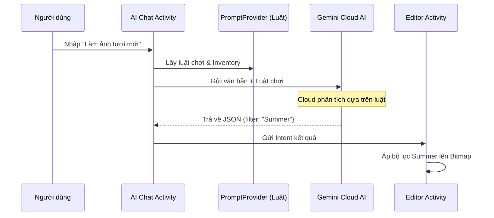
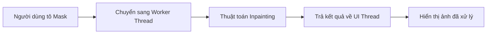

# Tài liệu Kỹ thuật: Cơ chế phối hợp AI (Activity, SDK & Thread)

Tài liệu này mô tả chi tiết cách hệ thống xử lý các tính năng AI, đảm bảo hiệu suất và trải nghiệm người dùng không bị gián đoạn.

---

## 1. Hệ thống Trợ lý AI (AI Chat) - [Cloud Processing]
**Chức năng:** Chuyển đổi yêu cầu bằng văn bản của người dùng thành các lệnh thực thi chỉnh sửa ảnh tự động thông qua trí tuệ nhân tạo (Gemini AI).

*   **Các file Java sử dụng & Lý do thiết kế:**
    *   **`AiAssistantActivity.java` (Receiver):** Quản lý giao diện chat. *Lý do:* Tách biệt hoàn toàn luồng hội thoại khỏi màn hình chỉnh sửa chính (`EditorActivity`) để giao diện không bị rối và dễ quản lý tin nhắn.
    *   **`GeminiApiClient.java`:** Xử lý kết nối mạng. *Lý do:* Đóng gói logic gọi API (Retrofit/OkHttp). Việc tách ra giúp dễ dàng bảo trì hoặc thay đổi cấu hình Cloud (như đổi API Key) mà không ảnh hưởng đến giao diện.
    *   **`PromptProvider.java`:** Cung cấp tập lệnh hướng dẫn. *Lý do:* Đây là "bộ não" quy định cách AI hành xử. Nó ép AI phải trả về JSON và cung cấp danh sách bộ lọc có sẵn để AI không "nói chuyện phiếm".
    *   **`ChatAdapter.java`:** Quản lý hiển thị tin nhắn. *Lý do:* Sử dụng RecyclerView để tối ưu hiệu năng hiển thị, giúp màn hình chat cuộn mượt mà ngay cả khi hội thoại kéo dài.

*   **Quy trình (Phối hợp Receiver - Executor):**
    1. **Receiver (`AiAssistantActivity`):** Nhận JSON `{"action":"APPLY_FILTER", "filter_name":"Cinema"}` từ Cloud -> Giải mã và đóng gói vào Intent.
    2. **Transfer:** Gửi Intent chứa lệnh về màn hình chính qua cơ chế `setResult(RESULT_OK, intent)`.
    3. **Executor (`EditorActivity`):** Nhận Intent, đối chiếu tên bộ lọc "Cinema" và trực tiếp gọi hàm xử lý Bitmap để thay đổi diện mạo ảnh.

**Ví dụ thực tế (Xử lý trên Cloud):**
*   **Bước 1:** Người dùng nhập yêu cầu: "Làm cho ảnh rực rỡ và tươi sáng hơn".
*   **Bước 2:** AI (Gemini) phân tích dựa trên luật từ `PromptProvider` và trả về JSON: `{"brightness": 20, "saturation": 15}`.
*   **Bước 3:** Ứng dụng tự động điều chỉnh thanh độ sáng lên +20 và độ bão hòa lên +15 ngay lập tức mà người dùng không cần tìm nút chỉnh.

---

## 2. Hệ thống Xóa phông nền (Background Removal) - [Local Processing]
**Chức năng:** Tách diện tích vùng chứa chủ thể ra khỏi nền ảnh trực tiếp trên điện thoại.

*   **Các file Java sử dụng & Lý do thiết kế:**
    *   **`EditorActivity.java`:** Điều phối trực tiếp. *Lý do:* Thao tác xóa nền cần tác động trực tiếp vào Bitmap gốc đang hiển thị để trả kết quả tức thì mà không cần chuyển dữ liệu qua lại giữa các màn hình.
    *   **`SubjectSegmenter` (ML Kit SDK):** Thư viện nhận diện chủ thể. *Lý do:* Chạy Offline trên chip điện thoại để đảm bảo tốc độ tối đa, hoạt động ngay cả khi không có mạng và bảo mật ảnh của người dùng.

*   **Quy trình xử lý:** Quét Bitmap -> Phân tách pixel chủ thể và pixel nền -> Đặt độ trong suốt (Alpha = 0) cho các pixel vùng nền.

**Ví dụ thực tế (Xử lý trên Device):**
*   **Bước 1:** Người dùng nhấn nút "Xóa nền" trên một tấm ảnh chân dung.
*   **Bước 2:** ML Kit xác định chính xác các điểm ảnh thuộc về người và các điểm ảnh thuộc về cảnh vật phía sau ngay trên máy.
*   **Bước 3:** Ứng dụng xóa bỏ toàn bộ vùng cảnh vật, chỉ giữ lại người trên nền trong suốt (PNG).

---

## 3. Hệ thống Tẩy vật thể (Smart Eraser) - [Local Processing]
**Chức năng:** Xử lý lấp đầy vùng ảnh bị xóa bằng cách nội suy dữ liệu từ các vùng ảnh lân cận.

*   **Các file Java sử dụng & Lý do thiết kế:**
    *   **`MaskOverlayView.java`:** View tùy chỉnh để vẽ. *Lý do:* Như một "lớp kính" đè lên ảnh để ghi nhận nét vẽ đỏ (Mask) của người dùng mà không làm hỏng dữ liệu ảnh gốc trong lúc thao tác.
    *   **`Inpainter.java`:** Thuật toán vá ảnh. *Lý do:* Chứa các phép toán ma trận cực nặng để tái tạo điểm ảnh. Tách ra class riêng giúp chạy trên luồng phụ (Worker Thread), tránh gây đứng máy (ANR).

**Ví dụ thực tế (Xử lý trên Device):**
*   **Bước 1:** Người dùng tô đỏ một vật thể muốn xóa (ví dụ: một người lạ đứng xa trong ảnh bãi biển).
*   **Bước 2:** Thuật toán phân tích màu sắc, vân cát và ánh sáng của các vùng xung quanh vật thể đó.
*   **Bước 3:** Hệ thống vẽ lại các điểm ảnh cát/nước mới đè lên vị trí người lạ, khiến họ biến mất hoàn toàn và tự nhiên.

---

## 4. Quản lý Luồng và Tối ưu Hiệu năng

### Tại sao phải chia luồng (Concurrency)?
*   **UI Thread:** Chỉ làm nhiệm vụ hiển thị hình ảnh và nhận thao tác.
*   **Worker Thread (Dùng trong `Inpainter` & `ML Kit`):** Xử lý các phép toán AI nặng.
*   **Lý do:** Nếu AI chạy trên UI Thread, màn hình sẽ bị "đóng băng", người dùng không thể nhấn nút "Hủy" hay thoát app nếu việc tính toán diễn ra quá lâu.

### Tối ưu hóa bộ nhớ (RAM)
*   **Undo/Redo Stack:** Giới hạn tối đa 5-10 bước để tránh tràn RAM.
*   **Bitmap Recycle:** Gọi `bitmap.recycle()` để giải phóng vùng nhớ ngay khi bước chỉnh sửa đó bị loại bỏ khỏi ngăn xếp.
*   **Preview Mode:** Khi đang kéo thanh trượt, app chỉ xử lý trên ảnh thu nhỏ (Preview) để đảm bảo độ mượt (60fps). Chỉ áp dụng AI lên ảnh gốc khi nhấn "Lưu".

**Ví dụ thực tế xử lý RAM:**
*   **Tình huống:** Sửa ảnh 12MP (nặng ~48MB/tấm), nếu lưu 15 bước Undo sẽ tốn >700MB RAM gây văng app.
*   **Giải pháp:** Khi người dùng thực hiện đến bước thứ 11, ứng dụng tự động xóa bước 1 và giải phóng 48MB RAM tương ứng. RAM luôn ổn định dưới ngưỡng an toàn.

---

## 5. Sơ đồ Quy trình phối hợp (Mermaid)

### Quy trình Trợ lý AI (Cloud)

### Quy trình Xử lý Tẩy vật thể (Local)

