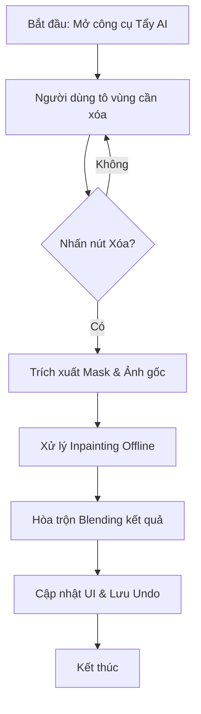
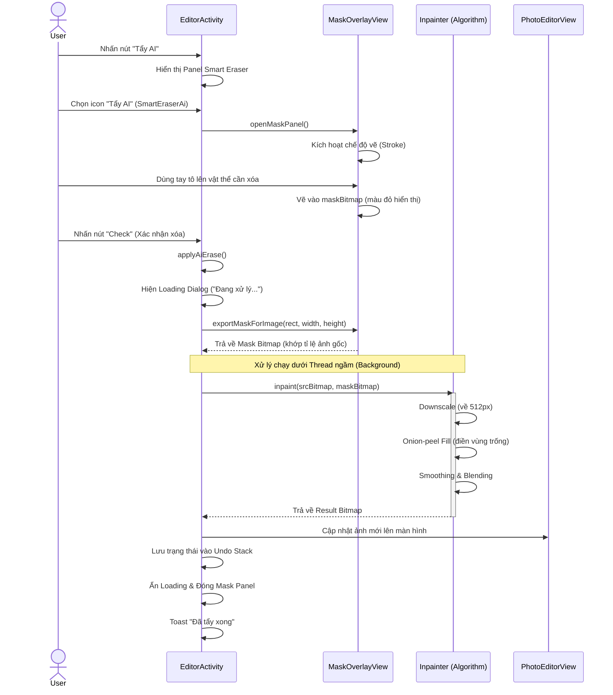

# Tài liệu Kỹ thuật: Chức năng Tẩy AI (Smart Eraser)

Tính năng **Tẩy AI** (Smart Eraser) cho phép người dùng loại bỏ các vật thể không mong muốn khỏi ảnh bằng cách tô lên vùng đó. Hệ thống sử dụng thuật toán Inpainting để bù đắp vùng bị xóa dựa trên dữ liệu hình ảnh xung quanh.

## 1. Luồng hoạt động (Workflow)

1.  **Giao diện tô Mask (`MaskOverlayView`)**: 
    -   Người dùng chọn công cụ Tẩy AI. Một lớp overlay trong suốt hiện lên trên ảnh.
    -   Người dùng dùng ngón tay tô màu đỏ lên vật thể cần xóa. Thực chất, hệ thống đang vẽ lên một `maskBitmap` (kênh Alpha trắng).
2.  **Trích xuất Mask**: 
    -   Khi nhấn "Xóa", hệ thống tính toán vị trí tương đối của ảnh trong View (xử lý Letterbox).
    -   Xuất `maskBitmap` về đúng kích thước và tỉ lệ của ảnh gốc.
3.  **Xử lý Inpainting (`Inpainter.java`)**:
    -   Thuật toán chạy Offline hoàn toàn để đảm bảo tốc độ và quyền riêng tư.
    -   Sử dụng cơ chế **Onion-peel content-aware fill**.
4.  **Cập nhật kết quả**:
    -   Ảnh sau khi xử lý được đưa vào `PhotoEditorView`.
    -   Lưu trạng thái vào Stack Undo/Redo.

## 2. Chi tiết thuật toán Inpainting (Offline)

Thuật toán trong lớp `Inpainter` thực hiện các bước sau:

-   **Hạ độ phân giải (Downscaling)**: Ảnh và mask được thu nhỏ về tối đa 512px để xử lý nhanh (real-time feel).
-   **Vòng lặp Onion-peel**: 
    -   Tìm các pixel thuộc Mask nằm ở "biên" (tiếp giáp với vùng ảnh thật).
    -   Tính toán màu sắc cho pixel đó bằng trọng số **Gaussian 3x3** từ các hàng xóm không thuộc mask.
    -   Xóa pixel đó khỏi Mask và lặp lại cho đến khi toàn bộ vùng trống được lấp đầy.
-   **Làm mượt (Smoothing)**: Chạy vài lượt Box-blur chỉ trong vùng mask để triệt tiêu các vết gãy tổ hợp.
-   **Hòa trộn (Blending)**: Upscale kết quả về kích thước gốc và dùng Mask để blend đè lên ảnh gốc, đảm bảo các vùng không được tô mask vẫn giữ nguyên độ nét 100%.

## 3. Các thành phần mã nguồn (Key Classes)

| Class | Nhiệm vụ |
| :--- | :--- |
| `MaskOverlayView.java` | Xử lý tương tác vẽ (Touch Events) và hiển thị nét vẽ đỏ. |
| `Inpainter.java` | Chứa logic xử lý ảnh lõi (Onion-peel fill). |
| `EditorActivity.java` | Điều phối UI, hiển thị Loading và quản lý Undo/Redo sau khi tẩy. |

## 4. Ưu điểm & Hạn chế

-   **Ưu điểm**:
    -   Chạy Offline 100%, không cần Internet.
    -   Tốc độ xử lý nhanh (< 2s cho hầu hết các thiết bị).
    -   Xử lý tốt các chi tiết nhỏ như: nốt mụn, rác trên đường, dòng chữ, dây điện.
-   **Hạn chế**:
    -   Với các vật thể quá lớn chiếm > 30% diện tích ảnh, kết quả có thể bị mờ (do thiếu dữ liệu tham chiếu xung quanh).
    -   Không nhận diện được ngữ cảnh cao cấp (như thay thế vật thể bằng một vật thể khác).

## 4.5. Cơ chế Xóa phông nền (Background Removal) - "Con mắt nhận diện"

Tính năng này giúp ứng dụng tự động "nhìn" thấy chủ thể để tách ra khỏi nền.

*   **Thư viện sử dụng**: `Google ML Kit (Subject Segmentation)`.
*   **Tại sao sử dụng?**: 
    - **Thông minh**: Nó được Google huấn luyện để nhận diện cực tốt người, chó, mèo, đồ vật...
    - **Tiết kiệm**: Chạy hoàn toàn Offline, không tốn tiền server, không cần mạng.
*   **Ý tưởng cốt lõi**:
    1. **Quét ảnh**: AI nhìn vào từng điểm ảnh (pixel) và tự hỏi: "Đây là người hay là cảnh?".
    2. **Chấm điểm**: Nó chấm điểm cho từng pixel. Pixel nào thuộc về người sẽ được giữ lại.
    3. **Cắt hình**: Hàm `getForegroundBitmap()` hoạt động như một cái kéo tàng hình, cắt đúng theo đường viền AI chỉ ra và làm cho phần nền cũ trở nên trong suốt.

## 5. Sơ đồ luồng (Flowchart)

## 7. Giải thích thuật ngữ & Ý tưởng cốt lõi

Để hiểu đơn giản về cách App xử lý hình ảnh, bạn chỉ cần nhớ 2 khái niệm sau:

### 1. Thuật toán "Lớp vỏ hành" (Onion-peel Inpainting) - Dùng cho Tẩy AI
Hãy tưởng tượng bạn có một tờ giấy bị thủng một lỗ. Để vá nó, thuật toán thực hiện:
- **Nhìn xung quanh**: Xem màu sắc ở rìa lỗ thủng là màu gì (ví dụ màu cỏ xanh).
- **Đắp dần vào trong**: Lấy màu xanh đó đắp vào trong lỗ từng lớp một, giống như bóc vỏ hành nhưng ngược lại (từ ngoài vào trong).
- **Làm mượt**: Sau khi đắp kín, dùng một chiếc "chổi ảo" quét nhẹ qua để vùng mới đắp hòa quyện vào ảnh cũ, không để lộ vết vá.
- **Tại sao tự viết?**: Để App hoạt động nhẹ nhàng trên mọi máy điện thoại mà không cần thêm thư viện AI nặng nề.

### 2. Quản lý ảnh bằng Bitmap
Toàn bộ ảnh trong App được hiểu là một bản đồ các điểm màu (Bitmap).
- **Chỉnh sáng**: AI bảo App cộng thêm "ánh sáng" vào từng điểm màu.
- **Xóa vật thể**: AI bảo App lấy màu vùng này đè lên vùng kia.
- **Undo/Redo**: App bí mật chụp lại "ảnh cũ" cất vào kho trước khi làm bất cứ việc gì, để nếu bạn không ưng ý thì App lôi ảnh cũ ra trả lại ngay lập tức.

Dưới đây là luồng xử lý chi tiết từ khi người dùng bắt đầu tô chọn vùng xóa cho đến khi nhận kết quả ảnh đã xử lý.

