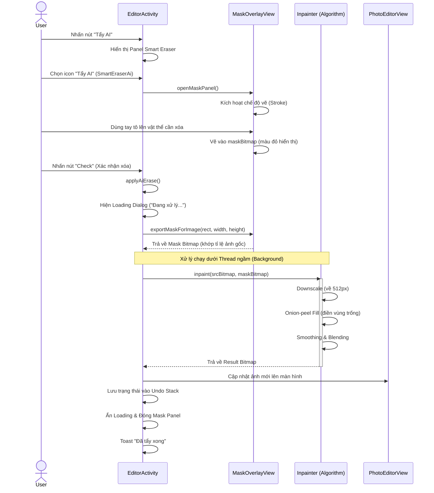

# Sequence Diagram: Tẩy AI (Smart Eraser)

Dưới đây là luồng xử lý chi tiết từ khi người dùng bắt đầu tô chọn vùng xóa cho đến khi nhận kết quả ảnh đã xử lý.

## Giải thích các bước quan trọng:

1.  **Chuyển đổi tọa độ**: Vì ảnh hiển thị trong `PhotoEditorView` có thể bị co giãn (Letterbox/FitCenter), `EditorActivity` phải tính toán `RectF` chính xác để trích xuất Mask từ `MaskOverlayView` sao cho khớp từng pixel với ảnh gốc.
2.  **Thread ngầm**: Việc xử lý `Inpainter` tốn nhiều CPU nên được thực hiện trong một `Thread` riêng để không làm treo giao diện (UI Thread).
3.  **Hòa trộn (Blending)**: Bước cuối cùng trong `Inpainter` cực kỳ quan trọng; nó chỉ lấy vùng đã sửa đè lên vùng Mask của ảnh gốc, giúp giữ nguyên 100% độ nét của những vùng không bị tác động.
