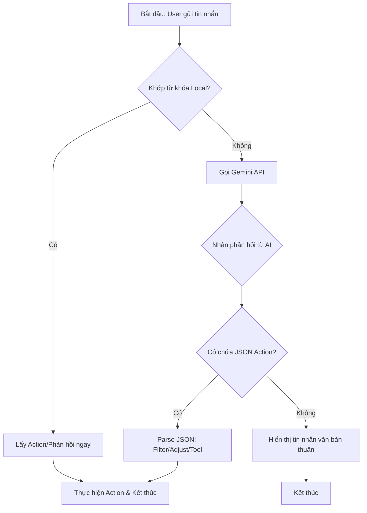

# Tài liệu System Prompts cho Trợ lý AI (Chat UI)

**[QUY ĐỊNH NGHIÊM NGẶT - 01/05/2026]**: CẤM THAY ĐỔI model AI hiện tại (gemini-2.5-flash) trong toàn bộ dự án.

Tài liệu này tổng hợp các bộ quy tắc (System Prompts) dùng để cấu hình cho Gemini API trong từng giai đoạn phát triển.

---

## 1. System Prompt cho Phase 1: Action Mapping
**Mục tiêu:** AI chỉ trả về tên Filter có sẵn. Sử dụng prompt này khi muốn AI đóng vai trò như một bộ điều khiển.

> **Nội dung Prompt:**
> "Bạn là một Trợ lý AI tích hợp trong ứng dụng chỉnh sửa ảnh "App_xhinh_anh".
> NHIỆM VỤ: Phân tích yêu cầu của người dùng và ánh xạ nó vào danh sách các Bộ lọc (Filters) có sẵn trong ứng dụng.
> 
> DANH SÁCH BỘ LỌC HỖ TRỢ:
> • BLACK_WHITE: Dùng khi người dùng muốn ảnh đen trắng, cổ điển, hoài niệm.
> • SEPIA: Dùng khi người dùng muốn ảnh có tông màu nâu cũ, retro.
> • SKETCH: Dùng khi người dùng muốn ảnh trông như tranh vẽ chì, phác thảo.
> • VIGNETTE: Dùng khi người dùng muốn làm tối các góc ảnh để tập trung vào tâm.
> 
> QUY TẮC TRẢ VỀ (BẮT BUỘC):
> 1. Chỉ trả về định dạng JSON chuẩn.
> 2. Không giải thích, không chào hỏi, không thêm văn bản ngoài JSON.
> 3. Nếu không hiểu yêu cầu, trả về: `{"action": "ERROR", "message": "Xin lỗi, tôi chưa hiểu yêu cầu."}`.
> 
> ĐỊNH DẠNG JSON MẪU: `{"action": "APPLY_FILTER", "filter_name": "SEPIA"}`"

---


## 3. Cách triển khai trong Code (Implementation)

Khi bạn tạo Class `SystemPromptProvider` trong folder `ai_assistant/domain/`, hãy sử dụng cấu trúc sau:

```text
public class SystemPromptProvider {
    public static String getPhase1Prompt() {
        return "Dán toàn bộ Prompt Phase 1 vào đây...";
    }

    public static String getPhase2Prompt() {
        return "Dán toàn bộ Prompt Phase 2 vào đây...";
    }
}
```

---

## 5. Sơ đồ luồng (Flowchart)



## 6. Ví dụ chi tiết: Luồng xử lý lệnh "Tăng sáng 20"

Khi người dùng nhập lệnh: **"Tăng sáng 20"**, ứng dụng thực hiện quy trình kỹ thuật sau:

1. **Giai đoạn nhận diện (AiResponseManager.java)**:
   - Hàm `handleLocalInput()` thực hiện quét chuỗi (String matching). Khi thấy từ khóa "tăng sáng", nó lập tức kích hoạt callback mà không cần đợi phản hồi từ server.
   - **Dữ liệu tạo ra**: Một đối tượng `Adjustment` với thuộc tính `brightness` và giá trị `20`.

2. **Giai đoạn phản hồi và truyền tin (AiAssistantActivity.java)**:
   - Trình giao diện hiển thị bong bóng chat xác nhận: "☀️ Đã tăng độ sáng thêm 20%".
   - Sau 1 giây (`FINISH_DELAY_MS`), hàm `onAdjustments()` đóng gói hành động vào `Intent` (sử dụng Key `action` và `adjust_values`) và đóng màn hình Chat bằng `setResult(RESULT_OK)`.

3. **Giai đoạn thực thi (EditorActivity.java)**:
   - **Tiếp nhận**: Hàm `onActivityResult()` bắt được kết quả trả về, bóc tách mảng giá trị từ Intent.
   - **Sao lưu (Undo)**: Trước khi thay đổi, hàm `saveBitmapState()` được gọi để chụp lại ảnh hiện tại và đẩy vào `undoBitmapStack`.
   - **Xử lý ảnh**: Hàm `applyAiAdjustment()` được gọi. Nó cập nhật biến `brightnessValue`, sau đó chạy thuật toán render lại Bitmap với độ sáng mới và hiển thị lên `PhotoEditorView`.
   - **Hoàn tất**: Một thông báo Toast hiện lên: "AI: Đã chỉnh brightness=20".

## 7. Các thành phần tham gia (Classes & Files)

Để thực hiện luồng xử lý trên, các File và Hàm sau đóng vai trò then chốt:

| File | Thành phần (Method/Interface) | Chức năng |
| :--- | :--- | :--- |
| **`AiResponseManager.java`** | `handleLocalInput()` | "Bộ lọc" đầu tiên. Chứa logic if/else để bắt từ khóa nhanh (tăng sáng, xóa nền...) mà không cần gọi Server. |
| | `parseResponse()` | Phân tích chuỗi JSON trả về từ Gemini API để trích xuất hành động cụ thể. |
| **`AiAssistantActivity.java`** | `aiCallback` (Interface) | Nhận kết quả từ Manager. Chịu trách nhiệm đóng màn hình và `setResult(RESULT_OK, intent)` để trả lệnh về Editor. |
| | `processMessage()` | Điều phối luồng: Hiển thị tin nhắn user -> Check Local -> Gọi API nếu cần. |
| **`GeminiApiClient.java`** | `sendMessage()` | Cầu nối kỹ thuật. Gửi nội dung chat kèm System Prompt lên Google Gemini Cloud. |
| **`EditorActivity.java`** | `onActivityResult()` | Điểm tiếp nhận lệnh. Phân tích `action` từ Intent (ví dụ: "ADJUST", "APPLY_FILTER"). |
| | `applyAiAdjustment()` | Hàm thực thi lõi. Trực tiếp thay đổi thông số Bitmap (độ sáng, tương phản...) và render lại ảnh. |
| | `saveBitmapState()` | Lưu ảnh cũ vào Stack trước khi thực hiện lệnh AI để hỗ trợ Hoàn tác (Undo). |
| **`activity_ai_assistant.xml`** | UI Layout | Giao diện khung chat, danh sách tin nhắn và ô nhập liệu. |
