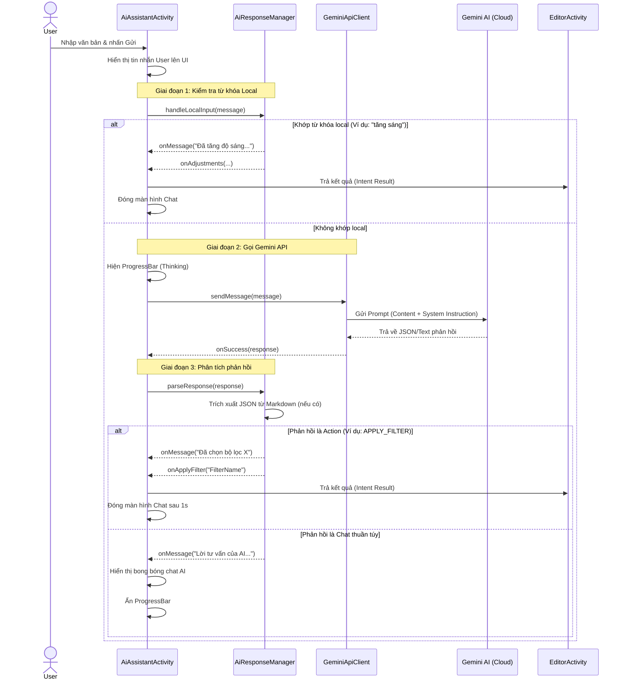

# Sequence Diagram: Chat AI Assistant

Tài liệu này mô tả luồng xử lý tin nhắn trong tính năng Trợ lý AI (Chat UI).

## Luồng xử lý tổng quát

## Các thành phần chính

1.  **AiAssistantActivity**: Quản lý giao diện Chat, RecyclerView và điều phối luồng.
2.  **AiResponseManager**: 
    -   `handleLocalInput`: Chứa logic If/Else để phản hồi ngay lập tức cho các lệnh phổ biến mà không tốn phí API.
    -   `parseResponse`: Sử dụng `JSONObject` để bóc tách hành động mà AI yêu cầu thực hiện.
3.  **GeminiApiClient**: Sử dụng Google Generative AI SDK để giao tiếp với model `gemini-pro`.
4.  **Intent Result**: Cơ chế quay về màn hình chỉnh sửa ảnh để thực thi các thay đổi (Filter, Adjustment) mà AI đề xuất.
